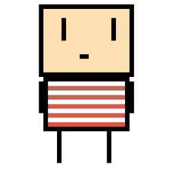

# Grapple (2.0 - major revamp)

Fast paced, competetive slaughter

## ☀️ Bright beginings

Grapple was made to compete in the [Kaboom game jam](https://replit.com/talk/announcements/KABOOM-JAM/127934).
We got 10th place 😁.
(no prize for that though).

## 🎮 Gameplay

-   ### 🎣 Grappling hook

Each player starts with a grappling hook. If any other player touches the grappling hook's line it will lower their health.

-   ### 🛠️ Loot

Loot will be scatered across the map for anyone to collect.
They are only spawned once per match.
When you kill other players they will drop their loot.
Loot is stored in your inventory.

-   #### 🔫 Guns

    Guns will serve as an alternative method to damage players.

-   #### ⚗️ Potions

    Potions serve as power-ups.

    -   (🏃‍♂️) 2x speed
    -   (💖) 25% health - restores 25% of your health
    -   (💖) 50% health - restores 50% of your health

-   🎁 Enigma crate
    Open to reveal random loot.

## 👥 Credits

### 🎨 Art

Thanks to my friend for drawing the sprites.

### 👨‍💻 Code contributors

Made with [contributors-img](https://contrib.rocks).

## 🤝 Contributing to Grapple

Please check out [CONTRIBUTING.md](/.github/CONTRIBUTING.md) _(I can't do this all by myself)_

## 💰 Support me

by donating to my crypto accounts

-   Ethereum: `0xCC27F23C05495a195fAD9f5d370A952cc44261d8`
